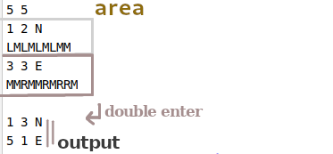
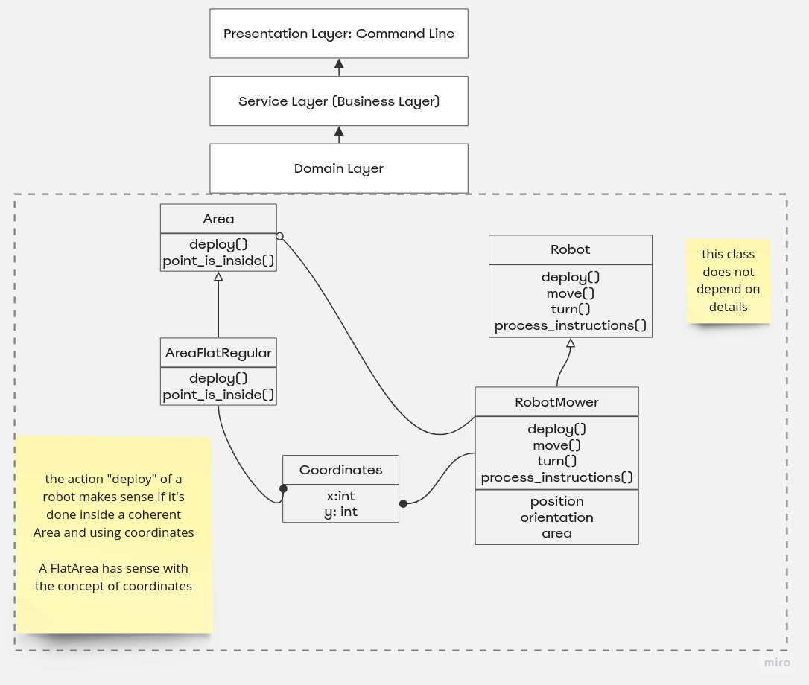

# Python Robot Controller
###### Robots moves in a delimited area
###### Version: 1.2, Last updated: 2021-03-09
Helps in controlling a thing that can move in an area. 

Thing are able to:
- cut the grass
- inspect the terrain
- identify problems in the green areas.

For the Minimal Viable Product (MVP):
- One green grass area only

- A green grass area, is curiously rectangular:
   
 - The area must be navigated by the Thing.(Point of view of the Area)
This lead to think that we can have more than one Thing
- Thing can cut the grass
- Thing camera can get a complete view of the surrounding terrain

The view will be send to the Factory/Office that is the one that
controls the Thing.

---

A Thing has:
- Location, expressed through coordinates: Coordinates(x,y)
- A Letter that represents one of the cardinal points (N,E,S,W)
North, East, South, West, that is the Orientation
- Position, expressed through Coordinates and Orientation/Direction: (0,0,N)

-----

The area is divided into a grid, to simplify the navigation.

The Factory/Office sends a string of letters.

Possible letters are: L,R,M
- L = turn left (90º)
- R = turn right (90º)
- M = move one step in the grid

Input:
- First Line: upper right coordinates of the Area. This serves to limit the Area

It is possible to "deploy" more than one Thing.
Each Thing has two lines of input.
  - First Line: Thing position
  - Second Line: A series of Instructions that tells the Thing how to "explore" the area.
  

Each Robot/Mover actions are sequential:
- the second Thing will start after the previous one had finished.

### Implementation
Following the Responsibility Driven Design,I've identify a Task that need to be done in the code,
using a high level of Abstraction: 
GAOL: Having an area, and a list of things in this area, we give instructions on how to move 
these objects, and we obtain a list of final positions.
Behaviour of our Application should come first:
--What the system does ? --> Move objects in an area.

I write test to mirror the language of the Domain experts, the Business side:
- set the Area
- deploy a Thing
- give to the Thing initial position and orientation
- sends to the Thing a strings of letters
- obtain its final position and orientation

Following the Kent Back principles of TDD 
[Test_Driven_Development][Kent Back principles of TDD], I wrote first the tests
and the name/declaration of these unit-tests describe the BEHAVIOUR that we want to see from the system.

[Kent Back principles of TDD]: 
https://www.goodreads.com/book/show/387190.Test_Driven_Development

In this way I  build the DOMAIN MODEL. 
Tests written in the Domain Language act as a living documentation, 
for developers in the present and in the future.

Then I've build a more High Level layer, that is the Service Layer, 
that uses primitives, and offers three simple services:
 - create robot
 - create area
- give instructions to a robot.

Final steps are to Add the Presentation Layer, in this case the Command Line.

app.py is the User Endpoint.

### Run App:
- install python3.9 and/or check its version with python3.9 --version
- install pip for python3.9 with 

`sudo apt-get install python3.4-dev python3.4-venv`
- Create the virtual environment with 

`cd PythonRobotController`

`python3.9 -m venv .env`

`source .env/bin/activate`

`pip3 install -r requirements.txt`

`python3.9 -m pytest tests/ -v`

`python3 app.py`

Since the program can "deploy" an unpredictable number of Thing(s), 
the only way to stop the process is to provide an invalid input to the program, 
so it is enough to press twice "Enter" and the program will stop, 
but before it prints what it has in memory, if you succeed on creating some robots.

5 5 

1 2 N

LMLMLMLMM

3 3 E

MMRMMRMRRM

Output is:

1 3 N

5 1 E

-----

 
 
 
-----
 
 
